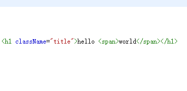
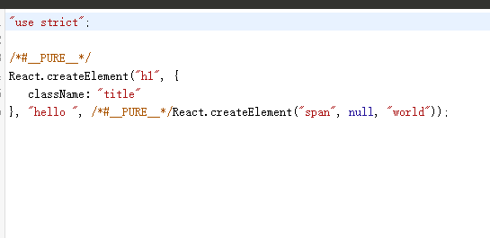
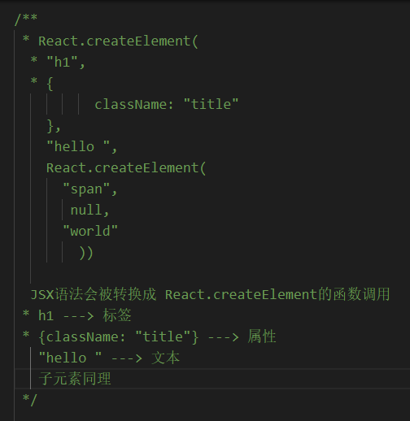
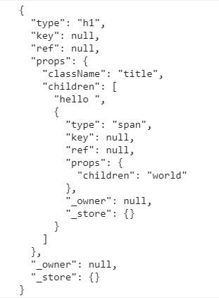

# React 学习笔记

## 1.JSX

> 是一种 JS 和 HTML 混合的语法,将组件的结构、数据甚至样式都聚合在一起定义组件

## 2. 语法转换图分析

### 2.1 源代码

 

### 2.2 编译时 babel 转换后的代码

 

### 2.3 转换后代码说明

 

## 3. React.createElement 返回值

> 返回值是一个 js 对象(虚拟 DOM)，描述了真实 DOM 的信息
> 

## 4. 实现 React.creatElement

```js
const REACT_TEXT = Symbol("REACT_TEXT");
const wrapToVdom = (element) => {
  return typeof element === "string" || typeof element === "number"
    ? { type: REACT_TEXT, props: { content: element } }
    : element;
};
/**
 * @description 创建一个React元素
 * @param {*} type 元素标签
 * @param {*} config 元素配置，包含ref,key,children。。。。
 * @param {*} children 子配置
 * @returns vDom
 */
function createElement(type, config, children) {
  let ref = null; // 标识元素
  let key = null; // 元素的唯一key
  if (config) {
    delete config.__self; // 删除babel添加的辅助性标识
    delete config.__source; // 删除babel添加的辅助性标识
    ref = config.ref;
    key = config.key;
    delete config.ref;
    delete config.key;
  }
  let props = { ...config };
  if (arguments.length > 3) {
    props.children = Array.prototype.slice.call(arguments, 2).map(wrapToVdom);
  } else {
    props.children = wrapToVdom(children);
  }
  return { type, ref, key, props };
}

const React = {
  createElement,
};

export default React;
```

 

## 5. 实现 ReactDOM.render

```js
# 将虚拟DOM转换成真实DOM并挂载到指定容器中
const REACT_TEXT = Symbol("REACT_TEXT");
function render (vDom, container) {
  return mount(vDom, container)
}
/**
 * @description 将虚拟dom创建成真实dom挂载到指定父容器上
 * @param {*} vDom 虚拟dom
 * @param {*} parentDOM 父容器
 */
function mount (vDom, parentDOM) {
  const dom = createDOM(vDom)
  if (dom) {
    return parentDOM.appendChild(dom)
  }
}
/**
 * @description 根据虚拟dom创建真实dom
 * @param {*} vDom 虚拟dom
 * @returns 真实dom
 */
function createDOM (vDom) {
  if (!vDom) return null
  const { type, props } = vDom
  let dom
  if (type === REACT_TEXT) {
    dom = document.createTextNode(props.content)
  } else {
    dom = document.createElement(type)
  }
  if (props) {
    updateProps(dom, {}, props)
    const child = props.children
    if (child) {
      if (typeof child === 'object' && child.type) {
        // 对象
        mount(child, dom)
      } else if (Array.isArray(child)) {
        // 数组
        reconcileChildren(child, dom)
      }
    }
  }
  return dom
}
/**
 * @description 批量挂载子节点
 * @param {*} child 子元素集合
 * @param {*} parentDOM 父元素
 */
function reconcileChildren (child, parentDOM) {
  for (let i = 0; i < child.length; i++) {
    mount(child[i], parentDOM)
  }
}
/**
 * 
 * @description 添加属性，diff对比
 * @param {*} dom 真实元素
 * @param {*} oldProps 旧属性
 * @param {*} newProps 新属性
 */
function updateProps (dom, oldProps, newProps) {
  for (let key in newProps) {
    if (key === 'children') {
      // 子节点单独处理
      continue
    } else if (key === 'style') {
      for (let styleKey in newProps[key]) {
        // 添加样式
        dom.style[styleKey] = newProps[key][styleKey]
      }
    } else {
      // 其他属性
      dom[key] = newProps[key]
    }
  }
}
const ReactDOM = {
  render
}
export default ReactDOM
```

 

## 6. 实现函数式组件

```js
# 示例
import React from './react'
import ReactDOM from './react-dom'

function FunctionComponent (props) {
  return <h1>hello {props.title}</h1>
}

ReactDOM.render(<FunctionComponent title='world' />, document.getElementById('app'))

# 实现
function createDOM (vDom) {
  if (!vDom) return null
  const { type, props } = vDom
  let dom
  if (type === REACT_TEXT) {
    dom = document.createTextNode(props.content)
  } else if (typeof type === 'function') {
      // 挂载函数式组件
    return mountFunctionComponent(vDom)
  } else {
    dom = document.createElement(type)
  }

  if (props) {
    updateProps(dom, {}, props)
    const child = props.children
    if (child) {
      if (typeof child === 'object' && child.type) {
        // 对象
        mount(child, dom)
      } else if (Array.isArray(child)) {
        // 数组
        reconcileChildren(child, dom)
      }
    }
  }
  return dom
}

/**
 * 
 * @param {*} vDom 虚拟Dom
 * @returns 真实dom
 */
function mountFunctionComponent (vDom) {
  const { type: FunctionComponent, props } = vDom
  const renderVdom = FunctionComponent(props)
  // 添加旧的虚拟dom，方便后期去做diff
  vDom.oldRenderVdom = renderVdom
  return createDOM(renderVdom)
}
```

## 7. 实现类组件

```js
# 示例
import React from './react'
import ReactDOM from './react-dom'

class ClassComponent extends React.Component {
  constructor(props) {
    super(props) // 调用父类的constructor方法
  }
  render () {
    console.log(this, 'this')
    return <h1>hello {this.props.title}</h1>
  }
}
ReactDOM.render(<ClassComponent title='world' />, document.getElementById('app'))

# 实现
class Component {
  // 此标识用来区分为类组件还是函数式组件
  static isReactComponent = true
  constructor(props) {
    this.props = props // 添加props属性
  }
}
export default Component
/**
 * @description 根据虚拟dom创建真实dom
 * @param {*} vDom 虚拟dom
 * @returns 真实dom
 */
function createDOM (vDom) {
  if (!vDom) return null
  const { type, props } = vDom
  let dom
  if (type === REACT_TEXT) {
    dom = document.createTextNode(props.content)
  } else if (typeof type === 'function') {
    if (type.isReactComponent) {
      // 类组件
      return mountClassComponent(vDom)
    } else {
      // 函数组件
      return mountFunctionComponent(vDom)
    }

  } else {
    dom = document.createElement(type)
  }

  if (props) {
    updateProps(dom, {}, props)
    const child = props.children
    if (child) {
      if (typeof child === 'object' && child.type) {
        // 对象
        mount(child, dom)
      } else if (Array.isArray(child)) {
        // 数组
        reconcileChildren(child, dom)
      }
    }
  }
  return dom
}
/**
 * 
 * @param {*} vDom 虚拟Dom
 * @returns 真实dom
 */
function mountClassComponent (vDom) {
  const { type: ClassComponent, props } = vDom
  const instance = new ClassComponent(props)
  const render = instance.render
  const renderVdom = render.call(instance)
  // 添加旧的虚拟dom，方便后期去做diff
  vDom.oldRenderVdom = renderVdom
  return createDOM(renderVdom)
}
```

## 8. 实现合成事件和批量更新状态

> 在实现之前，我们先看看让刚入门react的童鞋们疑惑的代码

### 8.1 代码1

```js
class ClassComponent extends React.Component {
  constructor(props) {
    super(props) // 调用父类的constructor方法
    this.state = {
      num: 0
    }
  }
  handleClick = () => {
    console.log(this.state.num, '0')
    this.setState({
      num: this.state.num + 1
    })
    console.log(this.state.num, '1')
    this.setState({
      num: this.state.num + 1
    })
    console.log(this.state.num, '2')
  }
  render () {
    return <div>
      <h1>{this.state.num}</h1>
      <button onClick={this.handleClick}>+</button>
    </div>
  }
}
```

 

### 8.2 代码2

```js
class ClassComponent extends React.Component {
  constructor(props) {
    super(props) // 调用父类的constructor方法
    this.state = {
      num: 0
    }
  }
  handleClick = () => {
    console.log(this.state.num, '0')
    this.setState(state => ({ num: state.num + 1 }))
    console.log(this.state.num, '1')
    this.setState(state => ({ num: state.num + 1 }))
    console.log(this.state.num, '2')
  }
  render () {
    return <div>
      <h1>{this.state.num}</h1>
      <button onClick={this.handleClick}>+</button>
    </div>
  }
}
```

 

### 8.3 代码3

```js
class ClassComponent extends React.Component {
  constructor(props) {
    super(props) // 调用父类的constructor方法
    this.state = {
      num: 0
    }
  }
  handleClick = () => {
    setTimeout(() => {
      console.log(this.state.num, '0')
      this.setState({
        num: this.state.num + 1
      })
      console.log(this.state.num, '1')
      this.setState({
        num: this.state.num + 1
      })
      console.log(this.state.num, '2')
    })
  }
  render () {
    return <div>
      <h1>{this.state.num}</h1>
      <button onClick={this.handleClick}>+</button>
    </div>
  }
}
```

 

> 是不是感到非常的奇怪，接下来让我们动动手一起去实现吧，实现之后相信大家的疑惑都会被解开的

### 8.4 实现setState

```js
# 实际上setState在React可以管辖到的地方只是将状态存起来了（并不会进行页面上的更新），等到后面触发生命周期/合成事件时在执行真正的更新
const updateQueue = {
  // 是否为批量更新模式,此变量控制了更新模式
  isBatchingUpdate: false,
  updaters: [],
  batchUpdate () {
    // 批量更新
    for (let i = 0; i < updateQueue.updaters.length; i++) {
      const update = updateQueue.updaters[i]
      update.updateComponent()
    }
    // 重置
    updateQueue.updaters.length = 0
    updateQueue.isBatchingUpdate = false
  }
}
class Updater {
  constructor(classInstance) {
    this.classInstance = classInstance
    this.pendingStates = []
  }
  addState (partialState) {
    this.pendingStates.push(partialState)
    this.emitUpdate()
  }
  emitUpdate () {
    const isBatchingUpdate = updateQueue.isBatchingUpdate
    if (isBatchingUpdate) {
      // 如果为批量更新模式，就将更新器都先存起来
      updateQueue.updaters.push(this)
    } else {
      // 去更新
      this.updateComponent()
    }
  }
  updateComponent () {
    const { classInstance, pendingStates } = this
    if (pendingStates.length > 0) {
      shouldUpdate(classInstance, this.getState())
    }
  }
  getState () {
    const { classInstance, pendingStates } = this
    let state = classInstance.state
    for (let i = 0; i < pendingStates.length; i++) {
      let pendingState = pendingStates[i]
      if (isFunc(pendingState)) {
        // this.setState((state) => ({num:state.num + 1}))
        pendingState = pendingState(state)
      }
      // 状态合并
      state = { ...state, ...pendingState }
    }
    this.pendingStates.length = 0
    return state
  }
}

function shouldUpdate (classInstance, nextState) {
  // 更新外界状态
  classInstance.state = nextState
  // 更新
  classInstance.forceUpdate()
}
class Component {
  // 此标识用来区分为类组件还是函数式组件
  static isReactComponent = true
  constructor(props) {
    /**
     * 这里的this指向的继承者组件，因为外界是super()
     */
    this.props = props
    this.state = {}
    this.updater = new Updater(this)
  }
  setState (partialState) {
    this.updater.addState(partialState)
  }
  forceUpdate () {
    const oldRenderVdom = this.oldRenderVdom
    const oldDom = findDOM(oldRenderVdom)
    const newVdom = this.render() // 这里的this指向组件实例
    compareTwoVDom(oldDom.parentNode, oldRenderVdom, newVdom)
    this.oldRenderVdom = newVdom
  }
}
/**
 * @description diff比较，暂时没有写
 * @param {*} parentNode 父节点
 * @param {*} oldVDom 老的虚拟dom
 * @param {*} newVDom 新的虚拟dom
 */
function compareTwoVDom (parentNode, oldVDom, newVDom) {
  const oldDom = findDOM(oldVDom)
  const newDom = createDOM(newVDom)
  parentNode.replaceChild(newDom, oldDom)
}

/**
 * 
 * @param {*} vDom 虚拟dom
 * @returns 根据虚拟dom找到对应的真实dom
 */
function findDOM (vDom) {
  // 递归
  // if (!vDom) return null
  // if (vDom.dom) {
  //   // 真实元素
  //   return vDom.dom
  // } else {
  //   // 组件就继续找
  //   return findDOM(vDom.oldRenderVdom)
  // }

  // 迭代
  const stack = [vDom]
  while (stack.length) {
    const vdom = stack.pop()
    if (!vdom) return null
    if (vdom.dom) return vdom.dom
    stack.push(vdom.oldRenderVdom)
  }
}
```

### 8.5 实现合成事件

```js
// dom上如果绑定了事件，就会先进入此方法
function addEvent (dom, eventName, eventHandle) {
  let _store
  // 给dom上添加自定义属性，方便dispatchEvent中去触发
  if (dom._store) {
    _store = dom._store
  } else {
    dom._store = {}
    _store = dom._store
  }
  // _store.onclick = handleClick
  _store[eventName] = eventHandle
  // 将状态都统一存放在document上
  if (!document[eventName]) {
    // document.onclick = dispatchEvent
    document[eventName] = dispatchEvent
  }
}

/**
 * @description 不管点什么按钮，触发什么事件，走的都是这个函数
 * @description 本质其实就一个切片函数，在执行用户的回调前开启批量更新模式，执行用户回调函数，关闭批量更新模式
 * @param {*} nativeEvent 原生event
 */
function dispatchEvent (nativeEvent) {
  // event.target = 当前点击的元素 button
  // event.type = 当前的事件名 click
  // event.currentTarget = 向上冒泡时的目标
  const { target, type } = nativeEvent
  const eventName = 'on' + type
  // 开启批量更新模式
  updateQueue.isBatchingUpdate = true
  // 创建合成event
  const syntheticEvent = createSyntheticEvent(nativeEvent)
  let currentTarget = target
  // 模拟向上冒泡的过程
  while (currentTarget) {
    // 拿到当前dom上的_store属性，只要dom上绑定了react的事件，react就会在这个dom上挂一个_store属性
    const _store = currentTarget._store
    // 拿到在_store属性上绑定的函数(用户的函数)
    const eventHandle = _store && _store[eventName]
    if (isFunc(eventHandle)) {
      syntheticEvent.target = target
      syntheticEvent.currentTarget = currentTarget
      // 调用用户的函数
      eventHandle.call(target, syntheticEvent)
    }
    currentTarget = currentTarget.parentNode
  }
  // 关闭批量更新
  updateQueue.isBatchingUpdate = false
  // 执行真正的更新
  updateQueue.batchUpdate()
}
// nativeEvent为原生的event，react在这里做了一些其他处理
function createSyntheticEvent (nativeEvent) {
  // 在这里可以做兼容性处理
  let syntheticEvent = { nativeEvent }
  for (let key in nativeEvent) {
    syntheticEvent[key] = nativeEvent[key]
  }
  return syntheticEvent
}
```

### 8.6 面试题：setState什么时候是同步，什么时候是异步？

- React能管辖到的地方就是异步的，比如合成事件中，生命周期中都是异步的
- React管辖不到的地方都是同步的，比如异步代码，如：原生事件、Promise.then、setTimeout...等都是同步的
- 内部通过一个`isBatchingUpdate`变量来控制是否为批量更新模式

## 9. 实现Ref

### 9.1 实现react元素上的ref

```js
# 示例
class ClassTestRef extends React.Component {
  constructor(props) {
    super(props);
    this.aRef = React.createRef();
    this.bRef = React.createRef();
    this.resultRef = React.createRef();
  }
  handleAdd = () => {
    const aValue = this.aRef.current.value;
    const bValue = this.bRef.current.value;
    this.resultRef.current.value = aValue + bValue;
  };
  render() {
    return (
      <div>
        <input type="text" ref={this.aRef} />+<br />
        <input type="text" ref={this.bRef} />
        <button onClick={this.handleAdd}>=</button>
        <br />
        <input type="text" ref={this.resultRef} />
        <br />
      </div>
    );
  }
}
ReactDOM.render(<ClassTestRef />, document.getElementById("app"));

# 实现
// react.js中
function createRef () {
  return { current: null }
}
// react-dom.js中
export function createDOM (vDom) {
  ...
  vDom.dom = dom
  if (ref) {
    // 指向真实DOM
    ref.current = dom
  }
  return dom
}
```

### 9.2 实现类组件上的ref

```js
# 示例
class Instance extends React.Component {
  constructor() {
    super();
    this.aRef = React.createRef();
    this.bRef = React.createRef();
    this.resultRef = React.createRef();
  }

  handleAdd = () => {
    const aValue = this.aRef.current.value;
    const bValue = this.bRef.current.value;
    this.resultRef.current.value = aValue + bValue;
  };

  render() {
    return (
      <div>
        <input type="text" ref={this.aRef} />+<br />
        <input type="text" ref={this.bRef} />
        <br />
        <input type="text" ref={this.resultRef} />
        <br />
      </div>
    );
  }
}
class ClassInstanceTestRef extends React.Component {
  constructor(props) {
    super(props);
    this.instanceRef = React.createRef();
  }
  handleAdd = () => {
    this.instanceRef.current.handleAdd();
  };
  render() {
    return (
      <div>
        <Instance ref={this.instanceRef} />
        <button onClick={this.handleAdd}>=</button>
      </div>
    );
  }
}
ReactDOM.render(<ClassInstanceTestRef />, document.getElementById("app"));

# 实现
// react.js中
function createRef () {
  return { current: null }
}

// react-dom.js中
function mountClassComponent (vDom) {
  ...
  instance.oldRenderVdom = vDom.oldRenderVdom = renderVdom
  if (ref) {
    ref.current = instance
  }
  return createDOM(renderVdom)
}
```

### 9.3 实现函数组件上的ref

```js
# 示例
function Func(props, ref) {
  return <input type="text" ref={ref} />;
}
// 转发ref到Func中
const ForwardFunc = React.forwardRef(Func);
class FuncTestRef extends React.Component {
  constructor(props) {
    super(props);
    this.instanceRef = React.createRef();
  }
  handleFocus = () => {
    this.instanceRef.current.focus();
  };
  render() {
    return (
      <div>
        {/* 需要使用forwardRef包裹一下 */}
        <ForwardFunc ref={this.instanceRef} />
        <button onClick={this.handleFocus}>获取焦点</button>
      </div>
    );
  }
}
ReactDOM.render(<FuncTestRef />, document.getElementById("app"));

# 实现
// react.js中
function createRef () {
  return { current: null }
}
// react-dom.js中
const REACTFORWARDREF = Symbol('react.forward_ref')
function createDOM (vDom) {
  ...
  if (type === REACT_TEXT) {
    dom = document.createTextNode(props.content)
  } else if (type.$$typeof === REACTFORWARDREF) {
    // forwardRef
    return mountForwardComponent(vDom)
  } else if (typeof type === 'function') {
    ...
  }
  ...
}
function mountForwardComponent (vDom) {
  const { type: FunctionComponent, props, ref } = vDom
  const renderVdom = FunctionComponent.render(props, ref)
  // // 添加旧的虚拟dom，方便后期去做diff
  vDom.oldRenderVdom = renderVdom
  return createDOM(renderVdom)
}  
```

### 9.4 总结Ref

- 在React元素上的ref，current指向真实的dom元素
- 在类组件上的ref，current指向类组件实例
- 在函数组件上的ref，需要使用`React.forwardRef包裹一层函数来达到转发ref的效果`，然后指向转发后ref被使用时的dom元素或实例

## 10. 生命周期

### 10.1 旧版生命周期

  

### 10.2 新版生命周期

 

## 11. 实现Diff算法

### 11.1 diff描述

> 框架中的概念都有一种思想：数据驱动视图，也就是说数据一旦发生变化，页面也会随之更新
>
> 对于使用者而言：不需要关注dom是怎么被操作的，让开发功能变得更集中化
>
> 对于框架本身而言：需要根据状态去推断出哪一个dom要发生变化，然后局部更新这个dom在呈现到页面上即可
>
> 这时候就出现了`虚拟DOM`和`Diff算法`
>
> `虚拟DOM`：本质其实就是一个js对象，描述一个真实DOM信息，从而避免频繁对`DOM`的取值和更新
>
> `diff算法`：根据`虚拟DOM`的一些状态信息来计算出哪些`DOM`要被移动、删除、更新、添加，复用已经存在但不需要更新的`DOM`节点来提高性能

### 11.2 React中Diff算法

- tree diff：分层求异，同层级比较，不会跨级比较

   

    

- component diff：如果是同一类型的组件，就按照tree diff进行对比，如果不是同一类型的组件，就会把原来的组件标记为dirty component（脏组件），从而替换整个组件下的所有子节点，也可以通过shouldComponentUpdate来决定组件是否需要更新

   

- 使用唯一key来帮助React识别列表中所有元素和组件

   

   

   

### 11.3 Diff算法逻辑

- 老新都没有，什么都不做

- 老的有，新的没有  --> 清空虚拟dom信息，卸载老节点，如果有子节点，递归卸载

- 老的没有，新的有 --> 创建新的虚拟dom挂载到父节点上

- 老的有，新的也有，但是类型不同（一个span,一个div）---> 清空虚拟dom信息，卸载老节点，如果有子节点，递归卸载，创建新的虚拟dom挂载到父节点上

- 老的有，新的也有，类型也一样（深度对比）
  - 5.1 如果都是文本，比对文本（更新 `旧节点文本为新的节点文本`，更新 `新的dom为老的dom，复用老的`）
  - 5.2 如果都是元素，比对属性、比对子节点
  - 5.3 如果是函数，区分类组件还是函数组件
  -  5.4 如果是类组件，更新 `props`，更新 `新的组件实例为老的组件实例，复用老的`,外界可以通过`shouldComponentUpdate`来决定是否需要更新页面,state和props总是会被更新，因为`shouldComponentUpdate`只能控制页面是否更新，state和props是一定会被更新的
  -  5.5 如果是函数组件,进行2次的虚拟dom比较，更新老的虚拟dom

### 11.4 Diff算法-伪代码

```js
function compareTwoVDom (parentNode, oldVDom, newVDom, nextDOM) {
  if (!oldVDom && !newVDom) { // 老新都没有，什么都不做
    return null
  } else if (oldVDom && !newVDom) { // 老的有，新的没有
    unmountVDom(oldVDom) // 卸载老节点
  } else if (!oldVDom && newVDom) { // 老的没有，新的有
    const currentDOM = createDOM(newVDom) // 创建dom插入
    if (nextDOM) {
      parentNode.insertBefore(currentDOM, nextDOM)
    } else {
      parentNode.appendChild(currentDOM)
    }
  } else if (oldVDom && newVDom && oldVDom.type !== newVDom.type) { // 老的有，新的也有，但是类型不同
    unmountVDom(oldVDom) // 卸载老节点
    const currentDOM = createDOM(newVDom) // 创建dom插入
    if (nextDOM) {
      parentNode.insertBefore(currentDOM, nextDOM)
    } else {
      parentNode.appendChild(currentDOM)
    }
  } else { // 老的有，新的也有，类型也一样
    updateElement(oldVDom, newVDom) // 深度对比
  }
}

function updateElement (oldVDom, newVDom) {
  if (oldVDom.type === REACT_TEXT) { // 都是文本
    updateText(oldVDom, newVDom) // 更新文本
  } else if (typeof oldVDom.type === 'string') { // 都是元素
    const currentDOM = newVDom.dom = findDOM(oldVDom)
    updateProps(currentDOM, oldVDom.props, newVDom.props) // 更新属性
    updateChildren(currentDOM, oldVDom.props.children, newVDom.props.children) // 更新子节点
  } else if (typeof oldVDom.type === 'function') { // 都是函数
    const isReactComponent = oldVDom.type.isReactComponent
    if (isReactComponent) { // 类组件
      updateClassComponent(oldVDom, newVDom) // 更新类组件
    } else { // 函数组件
      updateFunctionComponent(oldVDom, newVDom) // 更新函数组件
    }
  }
}
```

### 11.5 Diff算法-全代码

```js
/**
 * @description diff比较
 * @param {*} parentNode 父节点
 * @param {*} oldVDom 老的虚拟dom
 * @param {*} newVDom 新的虚拟dom
 */
function compareTwoVDom (parentNode, oldVDom, newVDom, nextDOM) {
  if (!oldVDom && !newVDom) { // 老新都没有，什么都不做
    return null
  } else if (oldVDom && !newVDom) { // 老的有，新的没有
    unmountVDom(oldVDom) // 卸载老节点
  } else if (!oldVDom && newVDom) { // 老的没有，新的有
    const currentDOM = createDOM(newVDom)
    if (nextDOM) {
      parentNode.insertBefore(currentDOM, nextDOM)
    } else {
      parentNode.appendChild(currentDOM)
    }
  } else if (oldVDom && newVDom && oldVDom.type !== newVDom.type) { // 老的有，新的也有，但是类型不同
    unmountVDom(oldVDom)
    const currentDOM = createDOM(newVDom)
    if (nextDOM) {
      parentNode.insertBefore(currentDOM, nextDOM)
    } else {
      parentNode.appendChild(currentDOM)
    }
  } else { // 老的有，新的也有，类型也一样
    updateElement(oldVDom, newVDom)
  }
}

function updateElement (oldVDom, newVDom) {
  if (oldVDom.type === REACT_TEXT) { // 都是文本
    updateText(oldVDom, newVDom)
  } else if (typeof oldVDom.type === 'string') { // 都是元素
    const currentDOM = newVDom.dom = findDOM(oldVDom)
    updateProps(currentDOM, oldVDom.props, newVDom.props)
    updateChildren(currentDOM, oldVDom.props.children, newVDom.props.children)
  } else if (typeof oldVDom.type === 'function') { // 都是函数
    const isReactComponent = oldVDom.type.isReactComponent
    if (isReactComponent) { // 类组件
      updateClassComponent(oldVDom, newVDom)
    } else { // 函数组件
      updateFunctionComponent(oldVDom, newVDom)
    }
  }
}

// 更新类组件
function updateClassComponent (oldVDom, newVDom) {
  const classInstance = newVDom.classInstance = oldVDom.classInstance
  classInstance.updater.emitUpdate(newVDom.props)
}

// 更新函数组件
function updateFunctionComponent (oldVDom, newVDom) {
  const currentDOM = findDOM(oldVDom)
  const parentDOM = currentDOM.parentNode
  const newRenderDOM = newVDom.type(newVDom.props)
  compareTwoVDom(parentDOM, oldVDom.oldRenderVdom, newRenderDOM)
  newVDom.oldRenderVdom = newRenderDOM
}

// 更新子节点集合
function updateChildren (dom, oldVChildren, newVChildren) {
  oldVChildren = Array.isArray(oldVChildren) ? oldVChildren : oldVChildren ? [oldVChildren] : []
  newVChildren = Array.isArray(newVChildren) ? newVChildren : newVChildren ? [newVChildren] : []
  const oldVChildMap = {} // 映射表
  let lastPlacedIndex = 0
  let patch = [] // 存放操作的数组

  oldVChildren.forEach((oldVChild, index) => { // 填充映射表
    const key = oldVChild.key || index // 没有key就用index
    oldVChildMap[key] = oldVChild
  })

  newVChildren.forEach((newVChild, index) => {
    newVChild._mountIndex = index // 挂载的索引
    const newVChildKey = newVChild.key || index
    const oldVChild = oldVChildMap[newVChildKey]

    if (oldVChild) {
      // 此节点更新前更新后都是存在的
      // 递归比对元素，属性,这里省略属性比对
      updateElement(oldVChild, newVChild)
      if (oldVChild._mountIndex < lastPlacedIndex) { // 要被移动
        /*使用key更新前
          *节点key:   A B C D 
          *节点索引:  0 1 2 3
         * 
         *使用key更新中
          *节点key:   B C D A
          *节点索引:  1 2 3 0
        
         * 第一次: lastPlacedIndex=0,_mountIndex=1,不变,lastPlacedIndex=1
           第二次: lastPlacedIndex=1,_mountIndex=2,不变,lastPlacedIndex=2
           第三次: lastPlacedIndex=2,_mountIndex=3,不变,lastPlacedIndex=3
           第四次: lastPlacedIndex=3,_mountIndex=0,A要从_mountIndex(0)移动到当前index(3),lastPlacedIndex=3

           结果为B、C、D、A
         */
        patch.push({
          type: MOVE,
          oldVChild,
          newVChild,
          fromIndex: oldVChild._mountIndex,
          toIndex: index
        })
      }
      // 删除存在的oldVChild
      delete oldVChildMap[newVChildKey]
      // 更新lastPlacedIndex
      lastPlacedIndex = Math.max(oldVChild._mountIndex, lastPlacedIndex)

    } else { // 新增节点
      patch.push({
        type: PLACEMENT,
        newVChild,
        toIndex: index
      })
    }
  })

  // removeChild方法只会把元素从页面中移除，还是会短暂的存在内存中一段时间
  const moveChilds = patch.filter(action => action === MOVE).map(item => item.oldVChild)
  // oldVChildMap中多余的要被清空掉,删除节点
  Object.values(oldVChildMap).concat(moveChilds).forEach(oldVChild => {
    const currentDOM = findDOM(oldVChild)
    currentDOM.parentNode.removeChild(currentDOM)
  })

  patch.forEach(action => {
    const { type, newVChild, oldVChild, fromIndex, toIndex } = action
    const childNodes = dom.childNodes // 获取真实的子DOM元素的集合[A,C,E]
    if (type === PLACEMENT) { // 新增新的DOM
      const currentDOM = createDOM(newVChild)
      const childDomNode = childNodes[toIndex]
      if (childDomNode) {
        dom.insertBefore(currentDOM, childDomNode)
      } else {
        dom.appendChild(currentDOM)
      }
    } else if (type === MOVE) { // 移动老的DOM
      const oldDom = findDOM(oldVChild)
      const childDomNode = childNodes[toIndex]
      if (childDomNode) {
        dom.insertBefore(oldDom, childDomNode)
      } else {
        dom.appendChild(oldDom)
      }
    }
  })
}

// 更新文本
function updateText (oldVDom, newVDom) {
  const currentDOM = newVDom.dom = findDOM(oldVDom)
  if (oldVDom.props.content !== newVDom.props.content) {
    currentDOM.textContent = newVDom.props.content
  }
}

/**
 * @description 卸载虚拟DOM
 * @param {*} vDom 虚拟DOM
 */
function unmountVDom (vDom) {
  const { props, ref } = vDom
  const currentDom = findDOM(vDom)
  // 移除ref
  if (ref) {
    ref.current = null
  }
  if (props.children) {
    // 一个为对象，多个为数组，这里统一处理
    props.children = Array.isArray(props.children) ? props.children : [props.children]
    // 如果父节点被卸载，递归卸载子节点
    props.children.forEach(unmountVDom)
  }
  // 页面中移除DOM
  if (currentDom) {
    currentDom.parentNode.removeChild(currentDom)
  }
}

/**
 * @description 根据虚拟dom找到对应的真实dom
 * @param {*} vDom 虚拟dom
 * @returns 真实DOM | null
 */
function findDOM (vDom) {
  // 递归
  // if (!vDom) return null
  // if (vDom.dom) {
  //   // 真实元素
  //   return vDom.dom
  // } else {
  //   // 组件就继续找
  //   return findDOM(vDom.oldRenderVdom)
  // }

  // 迭代
  const stack = [vDom]
  while (stack.length) {
    const vdom = stack.pop()
    if (!vdom) return null
    if (vdom.dom) return vdom.dom
    stack.push(vdom.oldRenderVdom)
  }

}
```

## 12. 实现React.Fragment

### 12.1 描述

> Fragments 允许你将子列表分组，而无需向 DOM 添加额外节点

### 12.2 用法

```js
# 写法1
<React.Fragment>
  <h1>hello</h1>
  <h1>world</h1>
</React.Fragment>

# 写法2
<>
  <h1>hello</h1>
  <h1>world</h1>
</>
```

### 12.3 实现React.Fragment

```js
const REACTFRAGMENT = Symbol('react.fragment')
const React = {
  ...
  Fragment: REACTFRAGMENT
}
function createDOM (vDom) {
  if (!vDom) return null
  const { type, props, ref } = vDom
  let dom
  if (type === REACT_TEXT) {
   	...
  } else if (type.$$typeof === REACTFORWARDREF) {
    ...
  } else if (type === REACTFRAGMENT) {
    // 创建文档碎片 react.fragment
    dom = document.createDocumentFragment()
  } else if (typeof type === 'function') {
      ...
  }
  return dom
}
```

## 13. 实现Context

### 13.1 描述

> Context 提供了一个无需为每层组件手动添加 props，就能在组件树间进行数据传递的方法
>
> React.createContext：创建一个 Context 对象,返回这个Context对象
>
> Context.Provider：订阅内容
>
> Context.Consumer/static contextType：消费内容

### 13.2 用法

```js
import React from "react";
import ReactDOM from "react-dom";

let Context = React.createContext(); // 创建Context对象
class ContextTest extends React.Component {
  state = {
    theme: "pink",
  };
  changeTheme = (color) => this.setState({ theme: color });
  render() {
    const themes = {
      color: this.state.theme,
      changeColor: this.changeTheme,
    };
    const style = {
      border: `1px solid ${themes.color}`,
    };
    return (
      <Context.Provider value={themes} style={style}>
        <div>
          <Header />
          <Main />
          <Footer />
        </div>
      </Context.Provider>
    );
  }
}

class Header extends React.Component {
  static contextType = Context;
  render() {
    const style = {
      border: `1px solid ${this.context.color}`,
    };
    return <header style={style}>header...</header>;
  }
}

class Main extends React.Component {
  static contextType = Context;
  render() {
    const style = {
      border: `1px solid ${this.context.color}`,
    };
    return (
      <main style={style}>
        <SideBar />
        <Content />
      </main>
    );
  }
}

class SideBar extends React.Component {
  static contextType = Context;
  render() {
    const style = {
      border: `1px solid ${this.context.color}`,
    };
    return (
      <div>
        <button style={style} onClick={() => this.context.changeColor("red")}>
          改变主题色 ---&gt; 红色
        </button>
      </div>
    );
  }
}

function Content() {
  return (
    <div>
      <Context.Consumer>
        {(context) => {
          const style = {
            border: `1px solid ${context.color}`,
          };
          return (
            <button style={style} onClick={() => context.changeColor("blue")}>
              改变主题色 ---&gt; 蓝色
            </button>
          );
        }}
      </Context.Consumer>
    </div>
  );
}

class Footer extends React.Component {
  static contextType = Context;
  render() {
    const style = {
      border: `1px solid ${this.context.color}`,
    };
    return <footer style={style}>footer...</footer>;
  }
}

ReactDOM.render(<ContextTest />, document.getElementById("app"));

```

### 13.3 实现Context

```js
# 1. React.createContext
function createContext () {
  // 用循环引用的方式来保证Provider和Consumer都可以拿到context对象
  const context = { $$typeof: CONTEXT, currentValue: undefined }
  context.Provider = {
    $$typeof: PROVIDER,
    _context: context
  }
  context.Consumer = {
    $$typeof: CONTEXT,
    _context: context
  }
  return context
}

# 2. mountProvider
function mountProvider (vdom) {
  const { type, props } = vdom
  const context = type._context
  // 传递到Provider上的value会被赋值给currentValue
  context.currentValue = props.value
  // 对于Provider来说，真正要渲染的其实是他的孩子
  const renderVdom = props.children
  vdom.oldRenderVdom = renderVdom
  return createDOM(renderVdom)
}

# 3. mountContext
function mountContext (vdom) {
  const { type, props } = vdom
  const context = type._context
  const currentValue = context.currentValue
  // 对于Consumer来说，他的孩子必须是一个函数，接受currentValue值作为参数
  const renderVdom = props.children(currentValue)
  vdom.oldRenderVdom = renderVdom
  return createDOM(renderVdom)
}

# 4. static contextType
function mountClassComponent (vDom) {
  ...
  if (ClassComponent.contextType) {
    // 使用了Context对象,会给当前组件实例上挂载一个context属性
    const currentValue = ClassComponent.contextType.currentValue
    instance.context = currentValue
  }
  ...
  return createDOM(renderVdom)
}

# 5. updateProvider
function updateProvider (oldVDom, newVDom) {
  const currentDOM = findDOM(oldVDom)
  const parentDOM = currentDOM.parentNode
  const { type, props } = newVDom
  const context = type._context
  // 更新value值
  context.currentValue = props.value
  const newRenderDOM = props.children
  compareTwoVDom(parentDOM, oldVDom.oldRenderVdom, newRenderDOM)
  newVDom.oldRenderVdom = newRenderDOM
}

# 6. updateContext
function updateContext (oldVDom, newVDom) {
  const currentDOM = findDOM(oldVDom)
  const parentDOM = currentDOM.parentNode
  const { type, props } = newVDom
  const context = type._context
  const currentValue = context.currentValue
  // 调用孩子函数，传递最新的currentValue，因为在上面已经更新了value值了
  const newRenderDOM = props.children(currentValue)
  compareTwoVDom(parentDOM, oldVDom.oldRenderVdom, newRenderDOM)
  newVDom.oldRenderVdom = newRenderDOM
}
```

## 14. 认识HOC(高阶组件)

### 14.1 描述

> HOC 自身不是 React API 的一部分，它是一种基于 React 的组合特性而形成的设计模式
>
> HOC 本质上是一个函数，接受一个组件作为参数，返回一个新组件，新组件内部套着旧组件，实现代码和逻辑的复用

### 14.2 实现拖拽

```js 
import React from "react";
import ReactDOM from "react-dom";
function withDrag(Component) {
  return class extends React.Component {
    state = {
      x: 0,
      y: 0,
    };
    dragContainer = React.createRef();
    handleMouseEnter = (e) => {
      const clientX = e.clientX;
      const clientY = e.clientY;
      this.setState({ x: clientX, y: clientY });
      this.dragContainer.current.addEventListener(
        "mousemove",
        this.handleMouseMove
      );
      this.dragContainer.current.addEventListener(
        "mouseup",
        this.handleMouseUp
      );
    };
    handleMouseMove = (e) => {
      const clientX = e.clientX;
      const clientY = e.clientY;
      const moveX = clientX - this.state.x;
      const moveY = clientY - this.state.y;
      this.dragContainer.current.style.left = moveX + "px";
      this.dragContainer.current.style.top = moveY + "px";
    };
    handleMouseUp = (e) => {
      this.dragContainer.current.removeEventListener(
        "mousemove",
        this.handleMouseMove
      );
      this.dragContainer.current.removeEventListener(
        "mouseup",
        this.handleMouseUp
      );
    };
    render() {
      const style = {
        position: "relative",
      };
      return (
        <div
          ref={this.dragContainer}
          style={style}
          onMouseDown={this.handleMouseEnter}
        >
          {/* 透传其他属性 */}
          <Component {...this.props} />
        </div>
      );
    }
  };
}

class Test1 extends React.Component {
  render() {
    const style = {
      width: "300px",
      height: "200px",
      border: "1px solid #ccc",
    };
    return <div style={style}>{this.props.title}</div>;
  }
}

class Test2 extends React.Component {
  render() {
    const style = {
      width: "300px",
      height: "200px",
      border: "1px solid #ccc",
    };
    return <div style={style}>{this.props.title}</div>;
  }
}

const WrapTest1 = withDrag(Test1);
const WrapTest2 = withDrag(Test2);

class App extends React.Component {
  render() {
    return (
      <>
        <WrapTest1 title={"拖拽1"} />
        <WrapTest2 title={"拖拽2"} />
      </>
    );
  }
}
ReactDOM.render(<App />, document.getElementById("app"));
```

### 14.3 总结

> 我们使用了 HOC 来完成的拖拽功能，这样我们就实现了一个通用的拖拽功能，任何组件想要拥有拖拽的功能，只需要用高阶组件包裹一层即可

## 15. 认识renderProps

### 15.1 描述

> 具有 render prop 的组件接受一个函数，该函数返回一个 React 元素并调用它而不是实现自己的渲染逻辑

### 15.2 实现拖拽

```js
import React from "react";
import ReactDOM from "react-dom";

class Test1 extends React.Component {
  render() {
    const style = {
      width: "300px",
      height: "200px",
      border: "1px solid #ccc",
    };
    return <div style={style}>{this.props.title}</div>;
  }
}

class Test2 extends React.Component {
  render() {
    const style = {
      width: "300px",
      height: "200px",
      border: "1px solid #ccc",
    };
    return <div style={style}>{this.props.title}</div>;
  }
}

class RenderProps extends React.Component {
  state = {
    x: 0,
    y: 0,
  };
  dragContainer = React.createRef();
  handleMouseEnter = (e) => {
    const clientX = e.clientX;
    const clientY = e.clientY;
    this.setState({ x: clientX, y: clientY });
    this.dragContainer.current.addEventListener(
      "mousemove",
      this.handleMouseMove
    );
    this.dragContainer.current.addEventListener("mouseup", this.handleMouseUp);
  };
  handleMouseMove = (e) => {
    const clientX = e.clientX;
    const clientY = e.clientY;
    const moveX = clientX - this.state.x;
    const moveY = clientY - this.state.y;
    this.dragContainer.current.style.left = moveX + "px";
    this.dragContainer.current.style.top = moveY + "px";
  };
  handleMouseUp = (e) => {
    this.dragContainer.current.removeEventListener(
      "mousemove",
      this.handleMouseMove
    );
    this.dragContainer.current.removeEventListener(
      "mouseup",
      this.handleMouseUp
    );
  };
  render() {
    const style = {
      position: "relative",
    };
    return (
      <div
        ref={this.dragContainer}
        style={style}
        onMouseDown={this.handleMouseEnter}
      >
        {this.props.children(this.state)}
      </div>
    );
  }
}

class App extends React.Component {
  render() {
    return (
      <>
        <RenderProps>
          {(props) => (
            <>
              <Test1 title={"拖拽1"} {...props} />
              <Test2 title={"拖拽2"} {...props} />
            </>
          )}
        </RenderProps>
      </>
    );
  }
}
ReactDOM.render(<App />, document.getElementById("app"));

```

### 15.3 总结(和高阶组件区别)

> 高阶组件：装饰组件能力，在原有组件上扩展额外的逻辑和交互，控制的权力在高阶组件上
>
> renderProps：提供能力给原有组件，原有组件内部的逻辑和交互不管，控制的权力在原有组件上

## 16. 实现PureComponent

## 17. 实现React.memo

## 18. 实现React.createPortal

## 19. 认识Hooks

